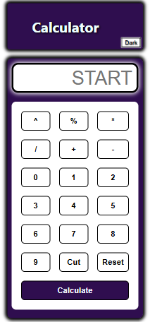
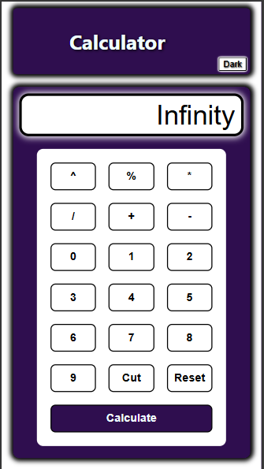
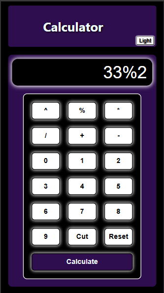

<h1>Calculator</h1>

This is just a random project to get familiar with javascript, 
and getting fluent with the css,html.
 

Here These are the ScreenShots of my webpage

</img>
</img>
</img>

<h2>HTML</h2>

- I used several tags in it. 

- I created seperation in page like by using header and main body.

- I used div to create the structure, by assignning them or dividing them or classifying them by thier class,id.

- I used input, button tag with thier type,value attribute, to get maximum clarity. 

- I also assgin both link stylesheet and script js in head and body respectively. 

<h2>CSS </h2> 

- I used perticular theme to showcase standardization

 
- I used downward structure form top to bottom structure to get maximun clarity for reader or for my self, this can be called as GoodPractice. 

- I Used two main display methods, like grid and flex whenever required. 

- I make sured about the responsiveness over devices, by checking major smallest and largest default device, by this I created responsive webpage. 

- I mainly focuses on allignement of webbpage by adding suitable padding and margin, with using vh unit to the height and widht, or by using % in some cases. 

<h2>JS</h2>

- I declared/initialize varibale by using var to them to extract or acces the data from document and his attributes. 

- Used loops is case of Theme shifter for day and night, by using flag variable. 

- Used forEach for the button of calci, cause they have similar functtionallity with different value.

- I used try and catch for the error handling, and used eval function to calculate the result. 

<h3>Note:</h3> 

- I Used several things, to get handy with basics and make sure to have basic knowledge. 

- As we ignore the basics, but we should know how the raw code works, and I know that this webpage may be not that catchy as compare to other framework's. But ya it will definitley increaes my knowledge. 

